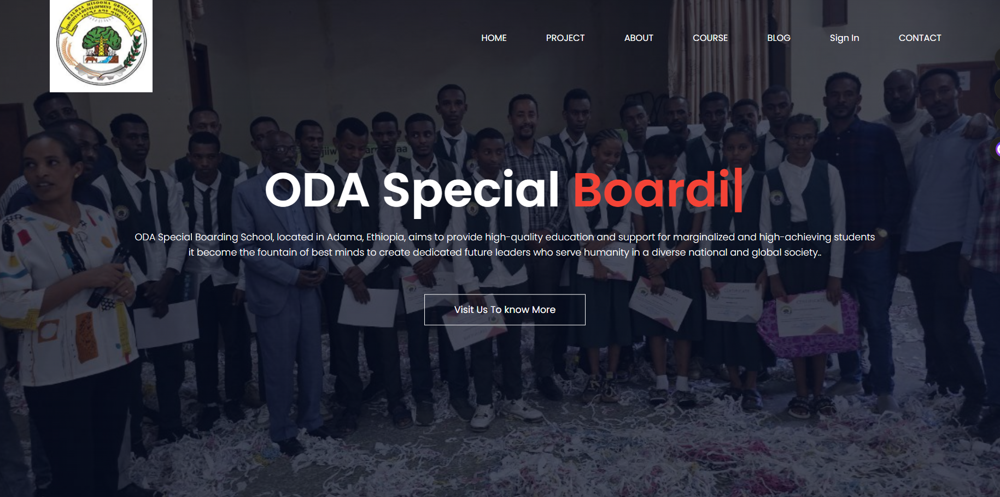
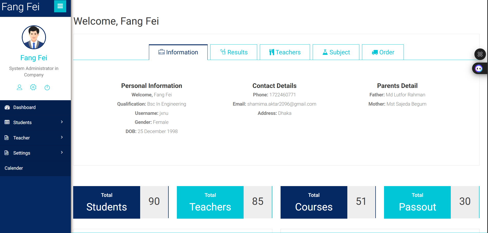
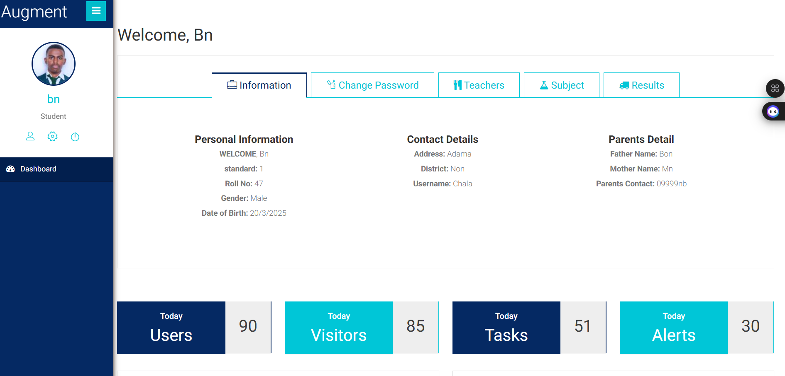
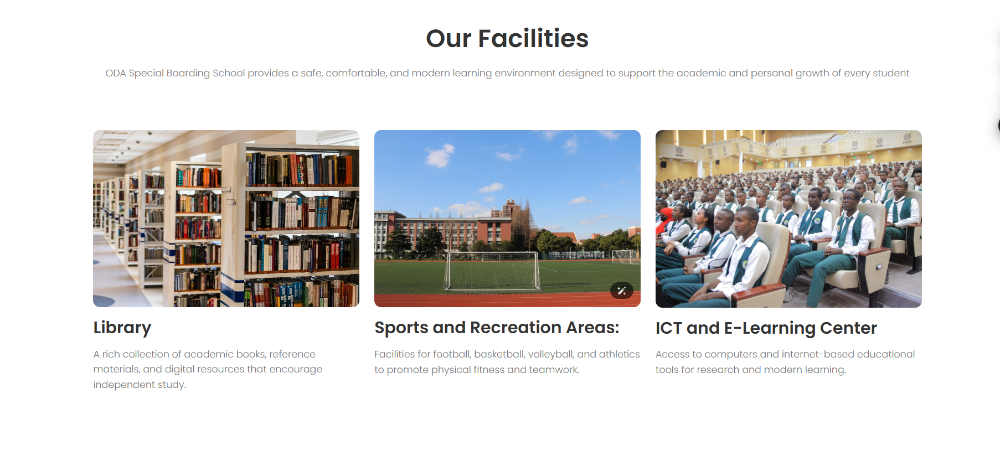
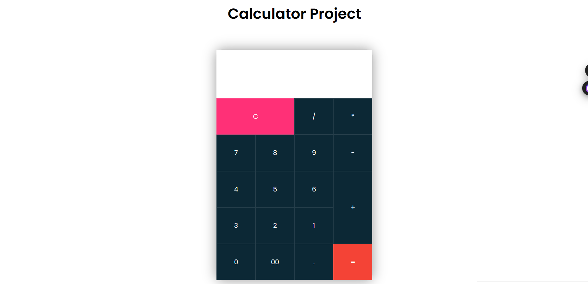
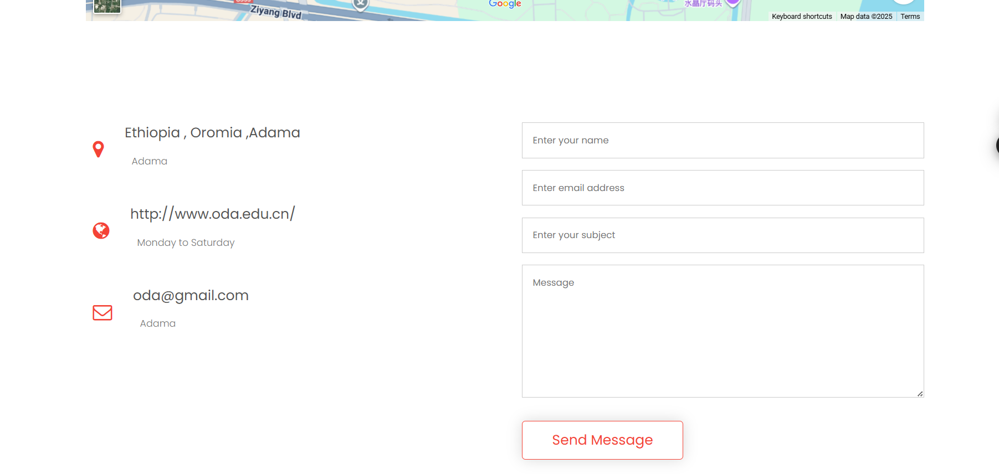

# 🎓 ODA Special Boarding School Website (Web-Based)

---

## 📘 Project Overview

The ** ODA Special Boarding School** is a **web-based platform** designed to simplify Specail School operations by managing student, teacher, and course data through an intuitive and responsive interface.

This system allows **administrators** to perform full CRUD operations (Create, Read, Update, Delete) on students and teachers, while **students** can securely log in to access their academic information.

The project demonstrates practical skills in **front-end design**, **server-side scripting**, and **database integration**, using technologies like **HTML, CSS, JavaScript, PHP, and MySQL**.

### 🎯 Objectives
- Automate university management processes.
- Provide separate dashboards for Admin and Student roles.
- Ensure secure data handling and responsive design.
- Implement interactive components using JavaScript.

---

## ✨ Key Features

### 🔑 1. Admin Dashboard
- Add, Edit, View, and Delete **Students**.
- Add, Edit, View, and Delete **Teachers**.
- Manage **Courses**, **General Settings**, and **School Information**.
- Simple and modern interface for admin control.

---

### 🎓 2. Student Portal
- Student Login with authentication.
- View **Teacher** and **Subject** details.
- Update personal password and profile settings.

---

### 📚 3. Library Management (JSON Project)
- Add books with details like Title, Author, ISBN, and Year.
- Update or Delete books directly from the displayed table.
- Data stored using **JSON local storage**.

---

### 🧮 4. Calculator
- Perform basic operations: Addition, Subtraction, Multiplication, Division.
- Built entirely with **JavaScript functions** for smooth user experience.

---

### 🖼️ 5. Image Gallery
- Automatic image slider using **Owl Carousel Plugin**.
- Manual control via arrows or swipe gestures.
- Visually appealing image transitions.

---

### 📞 6. Contact Page
- Integrated **Google Map** showing shool location.
- PHP-based contact form that sends user messages (works on live domain).

---

## 🧰 Technology Used

| Category | Technologies |
|-----------|--------------|
| **Frontend** | HTML5, CSS3, JavaScript |
| **Backend** | PHP |
| **Database** | MySQL |
| **Local Storage** | JSON |
| **Libraries & Plugins** | Owl Carousel, Google Fonts |
| **Development Tools** | XAMPP / WAMP Server, VS Code |
| **Design Approach** | Responsive Layout with Flexbox and Grid |

---

### 💡 Notes
> Ensure you have an **active internet connection** for Google Fonts to load correctly.  
> Host this project on a **PHP-enabled server** (e.g., XAMPP, WAMP, or live hosting).

---

## 📬 Contact
**Developer:** Wakjira Tesama 
**Email:** wakjiratesama@gmail.com

---

> _Thank you for reviewing this project!_  
> *Feel free to use, modify, and improve upon it.*
